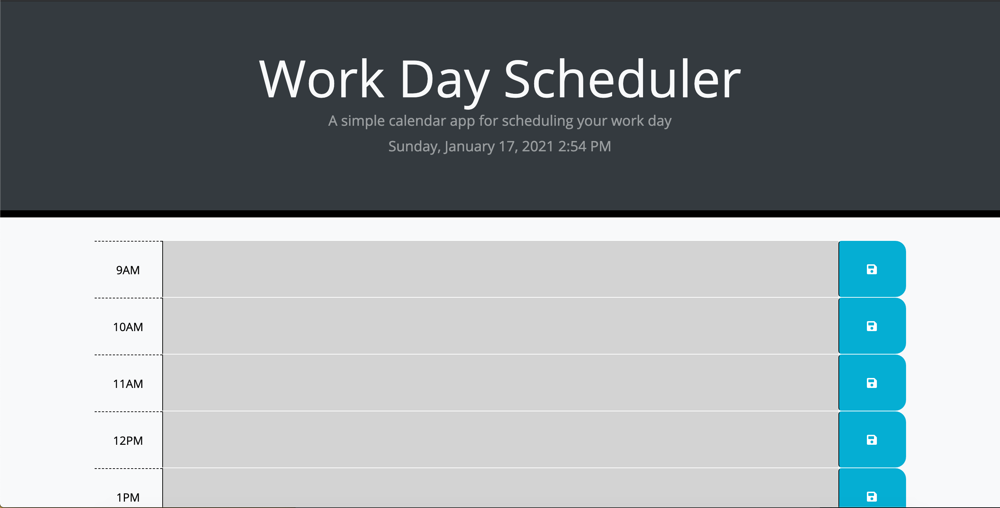
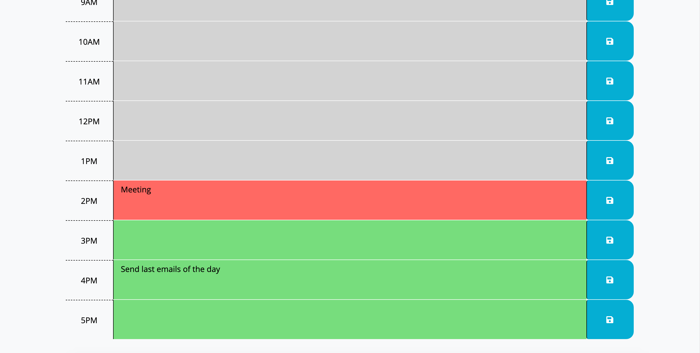

# Work-Day Scheduler

## Purpose
Work-Day Scheduler is an application that allows the user to create entries for various tasks that they need to complete throughout the typicall 9-5 work-day. To simplify recognizing which tasks have been done, which are due soon, and which need to be completed in the future, each block is color-coordinated according to the current time. Past tasks are colored grey, present tasks red, and future tasks green. Each task can be modified and re-saved after it has initially been entered, and each task persists in local storage once the page is refreshed. The current local time is also displayed at the top of the page for quick reference. 

## Built With:
* JavaScript
* HTML
* CSS

## Website
https://gwarzecha.github.io/work-day-scheduler/

## Creating the Application
This particular application was constructed using JavaScript, but with an emphasis on jQuery in particular. Moment.js was also utilized to supply date and time functionality. This was my first encounter with both jQuery and Moment.js, and similarly my first application of either. Bootstrap was also utilized in addition to a standard stylesheet to achieve more efficient and effective layout results. 

## Application Snapshots

